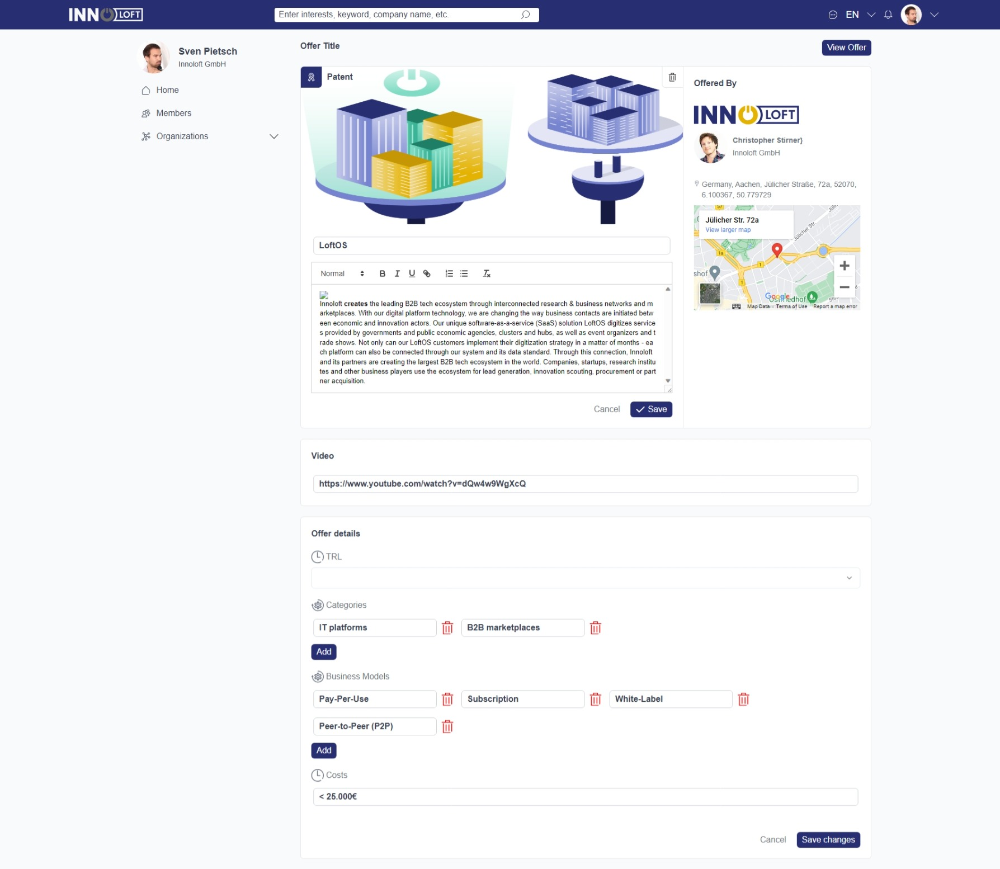

## Innoloft Frontend Developer Task Documentation

In this documentation, I will walk you through the process of completing the Innoloft frontend developer task.

### Screenshots

## Desktop View





## Mobile View


### Tech Stack

- **Next.js (React.js)**
- **Tailwind CSS**
- **Redux**:
- **Radix UI**
- **React hook forms**
- **Zod**

### Choice of Next.js and Radix UI

- **Next.js**: The decision to use Next.js was based on its ability to offer server-side rendering (SSR) and static site generation (SSG). These features significantly improve the performance and search engine visibility of the application.

- **Radix UI**: `Radix UI` was chosen for its collection of UI primitives that provide a consistent and accessible foundation for building user interfaces.

### Caching API Requests with Redux

To prevent excessive API requests, a technique was implemented using Redux. The `createAsyncThunk` function was used to fetch product data. A condition was set to prevent redundant requests. If the product data is already present in the Redux state.

```javascript
export const fetchProduct = createAsyncThunk(
  "fetchProduct",
  async (productId: string) => {
    // API request logic here
  },
  {
    condition: (_, { getState }) => {
      // Check if product data is already in the state
      return !getState().productState.product;
    },
  }
);
```

### Form Validation with React Hook Forms and Zod

The `react-hook-form` library was used for form validation. The `zod` library was used to define the schema for the form data. The `zodResolver` function was used to validate the form data.

```javascript
const schema = z.object({
  name: z.string().nonempty("Please enter a name"),
  description: z.string().nonempty("Please enter a description"),
  price: z.string().nonempty("Please enter a price"),
  image: z.string().nonempty("Please upload an image"),
});
```

### Preference for Zustand

While Redux was used for state management, it's worth mentioning that if I was given the choice, I would have chosen `Zustand` over `Redux` as `Zustand` requires fewer setup steps, provides a more concise codebase, and is known for its simplicity and ease of use while providing almost the same functionality as Redux.

### What I would have done differently if I had more time

- **Refactor the codebase**: I would have refactored the codebase to make it more readable and maintainable.
- **Extract reusable components**: I would have extracted some components and make them reusable to reduce code duplication.
- **Add tests**: I would have added unit and integration tests to the codebase to ensure that the application works as expected.
- **Add Loading and Error States**: I would have added loading and error states to the application to prevent a specific bug when the APP_ID is set to 2 and the defaualt values are loaded till the API request is completed, so the user sees the default values for a split second before the API request is completed.
- **Add a 404 Page**: I would have added a 404 page to the application to handle invalid routes.
- **Add axios**: I would have added axios to the application to handle API requests to make the codebase more readable and maintainable.

### How to run the application

- Clone the repository
- Run `npm install` to install the dependencies
- Run `npm run dev` to start the development server
- access the application on `http://localhost:3000`
